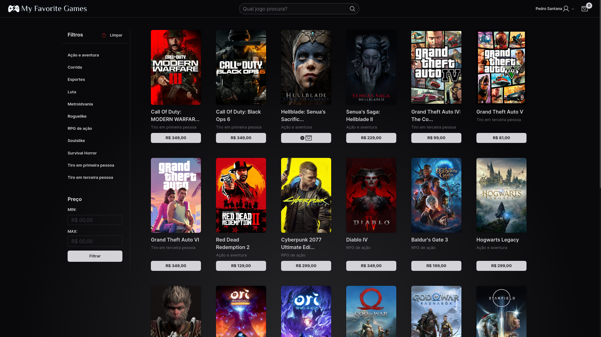
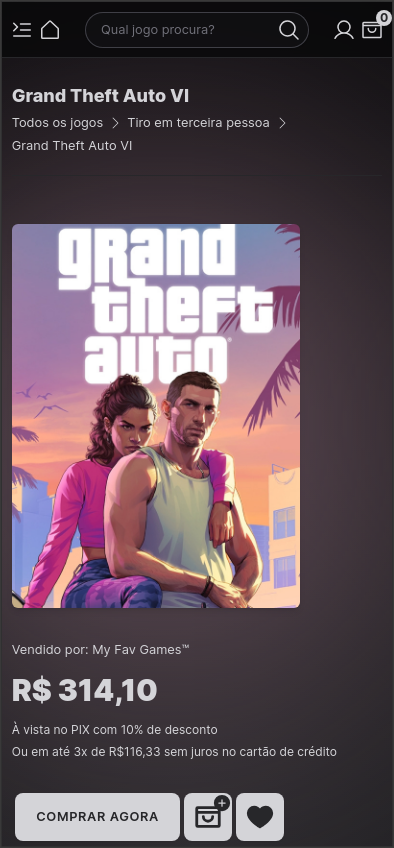
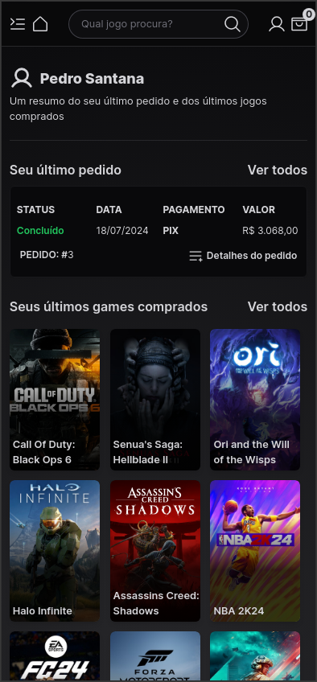

#  My Favorite Games

O My Favorite Games é um projeto pessoal fictício de um e-commerce para compra de jogos online.

Toda a aplicação é alimentada por uma [API](https://github.com/santanap2/my-favorite-games-api) também desenvolvida por mim exclusivamente para essa aplicação, visando suprir suas necessidades.

[Acesse agora o My Favorite Games](https://myfavgames.vercel.app/)

## Tecnologias utilizadas
### Principais:
  - ReactJS;
  - NextJS 14;
  - Typescript;
  - Next Auth: autenticação de usuário.
    
### Estilização:
  - TailwindCSS;
  - Phosphor Icons e Lucide-React: ícones da aplicação;
  - Shadcn UI: alguns componentes visuais;
  - React-Transition-Group: animação de menus laterais;
    
### Outros:
  - Axios: requisições para a API;
  - React-Hook-Form e Zod: validação de formulários;
  - Context API: gerenciamento de estado global;
  - ESLint: legibilidade e organização do código;
  - Variáveis de ambiente com .env.

## Fluxo da aplicação

### Cabeçalho
O cabeçalho é um item fixo do site, ele é exibido em todas as páginas da aplicação.
1) Botão com ícone do site ou uma casa (mobile) que direciona para a página inicial.
2) Campo de texto para buscar jogos pelo nome.
3) Botão que direciona para a página do usuário (/minha-conta) ao clicar. Ao passar o mouse em cima abre um pop-up com as páginas do usuário e um botão para fazer o logout.
4) Botão do carrinho com o número de itens adicionados em tempo real. Ao clicar, o carrinho abre lateralmente na tela exibindo todos os itens presentes com detalhes e um botão que direciona para a finalização da compra.
5) Em dispositivos mobile, um botão de lista no canto esquerdo do cabeçalho é exibido para abrir o menu lateral. Se o usuário estiver na rota "/home", o botão abrirá o menu de filtros da página inicial, se estiver em qualquer rota referente a "/minha-conta" abrirá o menu com as páginas do usuário e um botão para fazer logout.

### Página inicial
1) São exibidos jogos disponíveis para compra a partir de uma requisição feita para a API, com paginação exibindo 24 itens por página.
2) Cada card dos jogos possui imagem, nome, categoria e um botão contendo o preço do produto. Ao passar o mouse por cima do botão é exibido o ícone de adicionar ao carrinho e ao clicar no botão o item é adicionado somente se o usuário estiver autenticado. Caso contrário, ocorre um redirecionamento para a página de Login.
3) O usuário pode filtrar os jogos pela categoria, preço mínimo e preço máximo. Os filtros não se sobrepõem, ou seja, é possível selecionar quantos filtros o usuário desejar ao mesmo tempo.

### Página do produto
1) No topo são exibidos o nome do jogo e botões que direcionam para a página inicial e para a categoria que o jogo pertence.
2) Abaixo são exibidos a capa do jogo e as condições de pagamento. Pouco abaixo, há um botão para comprar agora (esvazia todo o carrinho e adiciona apenas esse jogo), botão para adicionar ao carrinho e botão para adicionar/remover dos favoritos. O botão de favorito ficará preenchido se o jogo estiver nos favoritos do usuário. Todos esses três botões requerem autenticação do usuário.
3) Lateralmente (ou abaixo, a depender do tamanho da tela), são exibidos detalhes do jogo, como sua descrição fornecida pela publicadora e jogos similares também disponíveis para a venda.
4) Abaixo, são exibidas as avaliações feitas por usuários a respeito do jogo, contendo estrelas (1 a 5), data e descrição da avaliação.

### Página de Login
1) São exibidos inputs e um botão para o usuário inserir seu email e senha cadastrados para fazer login.
2) Está presente um botão que direciona o usuário para uma página para redefinir sua senha.
3) É exibido um botão que direciona o usuário para a página de cadastro caso ele não possua uma conta.

### Página de cadastro
1) São exibidos inputs para o usuário se cadastrar na base de dados.
2) Os inputs presentes são: email, confirmação de email, nome completo, celular, senha e confirmação de senha.
3) São exibidos dois botões, um para efetuar o cadastro e outro para retornar à página de Login.

### Página de redefinir senha
1) É exibido um input para o usuário inserir sua seu email para que seja enviada uma nova senha para ele por email. (Ainda não implementado)

**OBS: As páginas de Cadastro, Login e Redefinir senha só são exibidas se o usuário não estiver autenticado. Caso esteja, será redirecionado para a página "/minha-conta".**

### Página de finalizar compra
1) Nessa página são exibidos todos os itens presentes no carrinho em detalhes, como nome, imagem, categoria, preço e condições de pagamento de cada produto.
2) É exibido também um resumo total do pedido, com valor total tanto à vista quanto no cartão de crédito, além das condições do parcelamento.
3) O usuário pode optar por prosseguir para o pagamento ou retornar para a página inicial para adicionar mais itens ao seu carrinho.

### Página de de pagamento
1) Aqui o usuário escolhe qual será seu método de pagamento entre PIX, boleto bancário e cartão de crédito.
2) PIX e boleto bancário não precisam de nenhuma etapa adicional. Ao selecionar cartão de crédito, um formulário para o usuário inserir as informações do cartão (número, nome, data do vencimento e código de verificação (CVV), além de selecionar as parcelas).
3) Nenhuma gateway de pagamento real está implementada, e nenhum dado inserido no formulário do cartão de crédito tem verificação real. O pagamento aqui é apenas simulado.

### Página de pedido realizado
1) Nessa página é exibido a barra de progresso do pedido do usuário, com as seguintes etapas:
  - Pedido realizado
  - Pagamento confirmado
  - Processando pedido
  - Pedido concluído
  - Pedido cancelado (oculto, só aparece se o status do pedido estiver cancelado no banco de dados)
2) Mais detalhes do pedido são exibidos, como número, data, valor total e método de pagamento.
3) Há um botão para o usuário visualizar todos os detalhes do pedido na área "Meus pedidos".

### Página de Detalhes do pedido
1) Os mesmos componentes da página de pedido realizado são exibidos nessa página, como a barra de progresso de status do pedido e detalhes.
2) Além disso, são exibidos todos os produtos comprados nesse pedido em cards na parte inferior.

### Página de Resumo (Minha conta)
1) É exibido no topo da página o nome cadastrado do usuário
2) É exibido na faixa lateral esquerda da tela um menu de navegação todas as páginas referentes ao usuário:
  - Resumo
  - Meus pedidos
  - Meus dados
  - Meus games
  - Meus favoritos
  - Minhas avaliações
  - Sair (Botão de logout)
3) Esse menu de navegação não é exibidos em telas mobile. Para exibir tal menu, o cabeçalho terá um botão no canto esquerdo que abrirá um pop-up com esse menu.
4) É exibido um card com alguns dados resumidos de seu último pedido feito, contendo número do pedido, status, data, método de pagamento e valor, além de um botão para ir para a página detalhada desse pedido em específico. Também há um botão para ver todos os pedidos.
5) Abaixo são exibidos seus últimos jogos comprados pelo usuário em pedidos que já estão com o status concluído.Também há um botão para ver todos os jogos adquiridos com o status concluído.

### Página de Meus pedidos
1) São exibidos cards para cada pedido com alguns dados resumidos, contendo número do pedido, status, data, método de pagamento e valor, além de um botão para ir para a página detalhada desse pedido em específico.
2) É possível filtrar os pedidos de acordo com seu status: todos, aguardando pagamento, cancelado, concluído, pagamento aprovado e processando.

### Página de Meus dados
1) Nessa página é possível verificar os dados cadastrados do usuário e modificá-los caso o usuário deseje.
2) É necessário que os campos senha atual e endereço de email estejam corretamente preenchidos para que qualquer alteração seja validada. 

### Página de Meus Games
1) Nessa página são exibidos todos os games adquiridos pelo usuário com status concluído.
2) É possível ordenar os jogos por ordem alfabética ou pela ordem que foram adquiridos.

### Página de Meus favoritos
1) Nessa página são exibidos todos os jogos selecionados como favoritos pelo usuário.
2) É possível ordenar os jogos por ordem alfabética ou pela ordem que foram adcionados aos favoritos.

### Página de Minhas avaliações
1) Nessa página é exibido um card para cada jogo comprado pelo usuário que esteja com o status concluído, com o número e a data do pedido referente.
2) Há um botão para avaliar o jogo caso não tenha sido feito ainda, que direciona para a página de avaliação do produto.
3) Caso a avaliação já tenha sido feita, o card estará marcado com "Produto avaliado", as estrelas dadas pelo usuário serão exibidas e o botão direcionará para o usuário ver sua avaliação com detalhes na página de detalhes da avaliação.
4) É possível ordenar as avaliações por ordem alfabética dos jogos ou pela ordem de data da compra.

### Página de Avaliação de produto
1) É exibida nessa página a capa do jogo, um campo para o usuário selecionar a nota (estrelas) e um campo de texto para que seja inserida a descrição (opcional) para a avaliação.
2) Ao clicar no botão "Avaliar produto", a avaliação será validada e feita. Posteriormente, haverá um feedback para o usuário em caso de sucesso ou erro e o botão exibirá a frase "Voltar para minhas avaliações" em caso de sucesso.

### Página de Detalhes da avaliação
1) É exibida nessa página a capa do jogo, a data da avaliação, a nota (estrelas) dada pelo usuário e a descrição fornecida para a avaliação.
2) Há um botão que direciona o usuário para editar sua avaliação caso queira.

### Página de Edição de avaliação
1) É bem similar à página de avaliação de produto, com os mesmos campos.
2) A nota (estrelas) e a descrição ao carregar a página serão as que o usuário forneceu previamente em sua avaliação.
3) Ao clicar no botão "Editar avaliação", os campos serão validada e a avaliação feita. Posteriormente, haverá um feedback para o usuário em caso de sucesso ou erro e o botão exibirá a frase "Voltar para minhas avaliações" em caso de sucesso.
